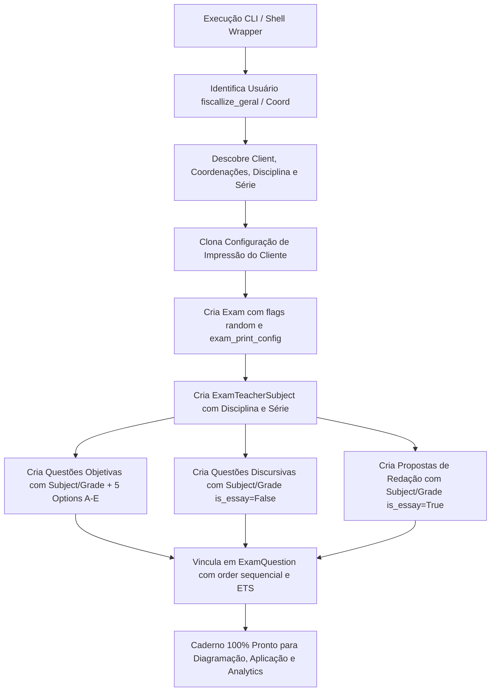

# Design: Gerador de Cadernos e Questões para Testes de QA

## Contexto e Decisões de Arquitetura

### 1. Localização e Escopo
A ferramenta reside no acervo de QA em `.ai_qa_acervo/scripts/`:
- `.ai_qa_acervo/scripts/create_test_exam.py`: Script Python com setup autônomo do Django (`os.environ` + `django.setup()`), suporte a argumentos via `argparse` e fallback interativo via prompt TTY.
- `.ai_qa_acervo/scripts/create-exam.sh`: Wrapper em Bash com `chmod +x` para invocação direta no terminal (`./.ai_qa_acervo/scripts/create-exam.sh ...`), detectando automaticamente o executável Python do ambiente virtual `./venv/bin/python`.

### 2. Paridade Rigorosa com Cadernos de Produção
A inspeção detalhada de instâncias recentes de `Exam` no banco de dados revelou relacionamentos e campos obrigatórios para que o caderno não apenas apareça na seleção da aplicação, mas também seja compatível com todo o ciclo de vida (diagramação, impressão de cabeçalhos por disciplina, correção, relatórios pedagógicos e exportações ERP):

1. **`exam_print_config` (`Exam.exam_print_config`):**
   - Em produção, todo caderno possui uma instância dedicada de `ExamPrintConfig`, clonada da configuração padrão do cliente (`client.get_exam_print_config()`).
   - Ao clonar e vincular essa configuração durante a criação do caderno, a tela de diagramação/impressão V2 (`/provas/<id>/v2/imprimir/`) abre instantaneamente sem necessidade de queries preguiçosas ou criação dinâmica em tempo de execução.
2. **`ExamTeacherSubject` (Vínculo Disciplina/Professor no Caderno):**
   - Os cadernos reais possuem uma instância de `ExamTeacherSubject` associando a disciplina (`Subject`), o professor (`TeacherSubject`) e a série (`Grade`).
   - No `ExamQuestion`, cada questão vincula-se a esse `ExamTeacherSubject` via FK `exam_teacher_subject`.
   - Isso garante que a impressão do caderno monte os cabeçalhos de divisão de matéria no PDF, e que relatórios por disciplina (Analytics, Boletins, OMR) processem as notas sem lançar questões em blocos "Sem disciplina".
3. **Atributos Pedagógicos da `Question`:**
   - `subject`: Chave estrangeira para a disciplina do cliente.
   - `grade`: Chave estrangeira para o ano/série escolar.
   - `level`: Nível de dificuldade (`Question.MEDIUM`).
4. **`Exam` (`fiscallizeon.exams.models.Exam`):**
   - Não possui chave estrangeira direta `client`. Seu vínculo com o tenant dá-se através da relação M2M `coordinations` (`SchoolCoordination`).
   - Para exibição no autocomplete (`exams:exams_api_list`), o caderno possui `not_applicable=False`, `is_abstract=False`, `quantity_alternatives=5` e pertence a uma coordenação autorizada.
5. **`QuestionOption` (`fiscallizeon.questions.models.QuestionOption`):**
   - Criação de 5 alternativas com índices 0 a 4 (letras A a E) para cada questão objetiva, definindo `is_correct = True` para a primeira alternativa.
6. **`ExamQuestion` (`fiscallizeon.exams.models.ExamQuestion`):**
   - Associa cada questão ao caderno com ordenação sequencial (`order = 1..N`), peso default (`weight = 1.0`) e vínculo ao `exam_teacher_subject`.

### 3. Compatibilidade e Resiliência de Banco (Residual Columns Gotcha)
Durante a homologação em ambientes de desenvolvimento onde múltiplas branches transitam, migrações aplicadas previamente podem deixar colunas `NOT NULL` sem default em tabelas compartilhadas (como ocorreu com `clients_examprintconfig.alternatives_separator_line` proveniente da branch de customização de layout de alternativas).
Para mitigar quebras na view de diagramação/impressão (`ExamPrintV2View`), as restrições `NOT NULL` dessas colunas no PostgreSQL devem ser flexibilizadas para permitir o `INSERT` padrão efetuado pelo Django quando a branch ativa não possui os novos campos no model.

## Diagrama de Fluxo

